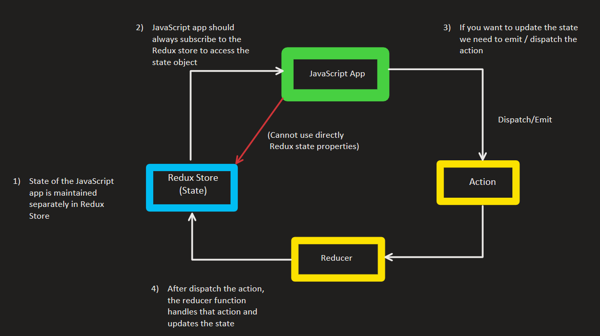

# ReactRedux

<!-- For complete understading on React Redux. [Click hear to read the basic concepts](https://github.com/PrasanthReddy-Chittapu6683/ReactRedux/blob/master/ReactReduxMaterial.md) -->


#  `React-Redux`

    -   React-Redux is the offical Redux UI libray for React


*   __`React is library used t build user interfaces`__
*   __`Redux is a library for managing state in a predictable way in JavaScript applications.`__
*   __`React -Redux is a library that provides bindings to use React and Redux together in an application.`__


### `Perrequisites`

*   Fundamentals of React.
*   React Repository path for beginners on my Git  [Click hear](https://github.com/PrasanthReddy-Chittapu6683/ReactJs-V16.13.1/tree/master/reactjs-my-learnings) -> Goto reactJs.txt material file to better understanding from scratch. 


## `What is Redux`

*   __`Reduc is a predictable state container for JavaScript apps`__
*   Redux is for Javascript application.
    *   Redux can be used for React, Angular, Vue and even with Vanilla JavaScript.
    *   Redux is a library for JavaScript applications.    
*   Redux is a state container
    *   Redux sotres the state of your application.
    *   `state of an application` means state represented by all individual components of that application.
        *    Ex: 
            LoginFormComponent:
            ``` json
                state = {
                    userName: '',
                    password: '',
                    submitting:false
                }
            ```
            UserListComponent:
            ``` json
                state = {
                    users : []
                }
            ```
*   Redux is predictable
    *   Redux is a state container, In any Java script application state can change.
        Ex:  In todo list application - item status:(pending) -> item status:(completed)
    *   In Redux, all state transitions are explicit and it is possible to keep track of them 
    *   The changes in your application's state become predictable.
    *   Redux wil store and manage the application state.
*   To manage the state of your application in a predicable way, redux can help.

## `Why Redux in React?`

*   Already we have components in React having their own state. Question is why we need another tool to manage the state?
*   Consider an application with several components and nested componentes. 
    *   Suppose if we need textbox that use can enter `user name` in Component A .
    *   Now, Sibling Component B needs to use `user name`. In react will do this by lifting the Component state to Component C.
    *   Now data can be managed in the Parent Component C then provide the data, methods and varibale as `props`  to Component A and B.
    *   What if we need to display in other Child Component of the other Parent Component and so on.. we just need to lifting the state to higher Components.
    *   This is not that easy to make changes eveytime.
    *   In React apppliction, if we have large no of components and want to share the state or data to other components, state management could become trouble. This where __`REDUX`__ helps out.
    *   Using Redux, your state is contains outside the Components. If Component A want to update the update the state, it communicates with Redux state container.
    *   Using this seperate Redux State container only the respective components get data from Redux State.
        


### `Setup the project`

*   Go to project folder path in Terminal, enter the commmand
    *   __`npm init --yes`__ This will create a `package.json` file with settings
        ```json
            {
                "name": "ReactRedux",
                "version": "1.0.0",
                "description": "",
                "main": "index.js",
                "scripts": {
                    "test": "echo \"Error: no test specified\" && exit 1"
                },
                "repository": {
                    "type": "git",
                    "url": "git+https://github.com/PrasanthReddy-Chittapu6683/ReactRedux.git"
                },
                "keywords": [],
                "author": "",
                "license": "ISC",
                "bugs": {
                    "url": "https://github.com/PrasanthReddy-Chittapu6683/ReactRedux/issues"
                },
                "homepage": "https://github.com/PrasanthReddy-Chittapu6683/ReactRedux#readme"
            }
        ``` 
*   Now add  `Redux` as a dependency for our project. Run the command in terminal
    *   __`npm install redux`__  once it is completed we can see the dependency added to packag.json
        ```json
            "dependencies": {
                "redux": "^4.0.5"
            }
        ```
*   Lets create javscript file to write our code. __`index.js`__
    *   Just print `console.log("From index.js")` and run command __`node index`__ . This will print the log statement in terminal.
        

### `Concepts in Redux`

*   In Redux we have mainly need to know about 3 concepts
    *   __`Store`__ : It Holds the state of your application (It will have your model object details)
    *   __`action`__ : It describes the changes in the state of the application (ie., Button click or dropdown change or any custom identification)
    *   __`reducer`__ : Which actually carries out the state transistion depending on the action. (Ties the store and actions together)  

*   Lets see how we can use this concepts

1.  __`The state of your whole application is stored in an object tree within a single store`__
    *   Maintain our application state in a single object which would be managed by Redux store.
2.  __`The only way to change the state is emit an action, an object describing what happened`__
    *   To update the state of your app, you need to let Redux know about that with an action.
    *   Not allowed to update directly to the state object.
3.  __`To specify how the state tree is transformed by actions, you write pure reducers`__
    *   In the 2nd principle `state` can only be transformed / changed by emit an actions. Using the reducer we can transform/change the state properties. For this we need to write pure reducer to determine how the state chagnes.
    *   Pure Reducers are pure functions that takes previous state  and action as an input and then transforms the state properties and return new State.
    *   Reducer - (previousState, action) => newState 
    *   Ex:
    ```Javascript
        const reducer =(state,action) => {
            switch(action.type) {
                case BUY_CAKE:
                    return {
                        numofCake: state.numofCake - 1
                    }
                case PREPAREL_CAKE:
                    return {
                        numofCake: state.numofCake + 1
                    }
            }
        }
    ```   
    
    
### `Actions`

*   Actions are the only way we can communicate with our application and Store.
*   Carry some information from application to the Redux store.
*   These are plain Javascript objects
*   The `type` property is typically defined as string constants
    *   Ex:
        ``` javascript
            const BUY_CAKE = 'BUY_CAKE'
            /** Define an action object that has type  */
            {
                type: BUY_CAKE,
                sellerName: 'PRCV'
            }
            /**This is action function */
            functio buyCake() {
                return {
                    type: BUY_CAKE,
                    sellerName: 'PRCV'
                }
            }
        ```

### `Reducers`

*   Specify how the app's state changes in response to actions sent to the store
*   Its a function that accepts state and actions as arguments, and returns the next/new/updated state of the application.
    *   Ex: `(previousState, action) => newState`
        ```javascript
            /** We creating default/initial state object which we can pass this as a state paramenter to reducer() function */
            const initialState = {
                numOfCakes: 10
            }

            /**Creting the reducer() function */
            const reducer = (state = initialState, action) => {
                switch (action.type) {
                    case BUY_CAKE:
                        return {
                            ...state,// This spread operator we are using to copy the existing object(other properties in the object will remain same)
                            numOfCakes: state.numOfCakes - 1
                        }
                    default:
                        return state;
                }
            }
        ```
### `Store / Redux Store`

*   One store for entire application
*   It is responsible to Holds application state.
*   It allows access to state via `getState()`
*   It allows state to be updated via `dispatch(action)`
*   It will register listeners via `subscribe(listener)`, It will accepts the function as its parameter which is executed anytime its state in the Redux store changes.
*   We can even `unregisterting/unsubscribing of listeners` via the function returned by `subscribe(listener)`
    *   Ex:
        ``` javascript
            //It is responsible to Holds application state
            const store = createStore(reducer)
            //It allows access to state via `getState()`
            console.log('Initial State ', store.getState())
            //It will register listeners via `subscribe(listener)`
            const unsubscribe = store.subscribe(() => console.log('Updated State', store.getState()))
            //It allows state to be updated via `dispatch(action)`
            store.dispatch(buyCake())
            store.dispatch(buyCake())// To cause state transistion we are just calling same dispatch function 
            store.dispatch(buyCake())
            //We can even `unregisterting/unsubscribing of listeners` via the function returned by `subscribe(listener)`
            unsubscribe();

        ```
    *   Now, goto termal and enter command `node index`
        *   __OutPut__:
            ``` javascript
                Initial State  { numOfCakes: 10 }
                Updated State { numOfCakes: 9 }
                Updated State { numOfCakes: 8 }
                Updated State { numOfCakes: 7 }
             ```
    *   __`Refer:`__
        *   index.js

### `Multiple Reducers`:

*   Let see how to create Multiple Reducers in our javascript application. In pervious example we see the BUY_CAKE scenario using reducer function. Now let see to add one more reducer fucntion to BUY_ICECREAMS.
    *   Ex:
    *   __`Approach : 1`__
        ```Javascript 
            //Step:1 - Add new Const variable
            const BUY_CAKE = 'BUY_CAKE'
            const BUY_ICECREAM = 'BUY_ICECREAM'
            //Step:2 - Add new Action object that represent ICECREMAS
            const actionObj_IceCreams = {
                type: BUY_ICECREAM,
                info: 'Second Redux function with Multiple reducer'
            }
            //Step:3 - Add new Action function that represent ICECREMAS
            function buyCake() {
                return actionObj_Cakes;
            }
            function buyIceCreams() {
                return actionObj_IceCreams;
            }
            //Step:4 - Add numOfIceCreams to initalState object
            const initialState = {
                numOfCakes: 10,
                numOfIceCreams: 20
            }
            //Step:5 - In Reducer function handle the scenario if action.type === 'BUY_ICECREAMS'
            const reducer = (state = initialState, action) => {
                switch (action.type) {
                    case BUY_CAKE:
                        return {
                            ...state,// This spread operator we are using to copy the existing object(other properties in the object will remain same)
                            numOfCakes: state.numOfCakes - 1
                        }
                    case BUY_ICECREAM:
                        return {
                            ...state,// This spread operator we are using to copy the existing object(other properties in the object will remain same)
                            numOfIceCreams: state.numOfIceCreams - 1
                        }
                    default:
                        return state;
                }
            }
            //Step:6 - Finally call dispatch function for  buyIceCreams()
            store.dispatch(buyCake())
            store.dispatch(buyCake())// To cause state transistion we are just calling same dispatch function 
            store.dispatch(buyCake())
            store.dispatch(buyIceCreams())
            store.dispatch(buyIceCreams())
        ```
        *   Output: Enter command `node Multiple_Reducers_Approach1`
        ``` javascript
            Initial State  { numOfCakes: 10, numOfIceCreams: 20 } // prints initial State object 
            Updated State { numOfCakes: 9, numOfIceCreams: 20 } // prints using dispath(buyCake()), cake count got decremented and icecreams count remain same
            Updated State { numOfCakes: 8, numOfIceCreams: 20 }// prints using dispath(buyCake()), cake count got decremented and icecreams count remain same
            Updated State { numOfCakes: 7, numOfIceCreams: 20 }// prints using dispath(buyCake()), cake count got decremented and icecreams count remain same
            Updated State { numOfCakes: 7, numOfIceCreams: 19 }// prints using dispath(buyCake()), cake count is remain same and icecreams count got decremented
            Updated State { numOfCakes: 7, numOfIceCreams: 18 }// prints using dispath(buyIceCreams()), cake count is same and icecreams count got decremented
        ```
        *   __`Refer``__:  
            *  __`Multiple_Reducers_Approach1`__ 
        * `Note: In the above approach we are handling only 2 scenarions buyCake() & buyIceCreams(), what if we have more scenarios to handle. Let see another approach`
    *   __`Approach : 2`__
         ```Javascript 
            //Step:1 - Creating default/initial state objects for both Cake and Icecream saperately
            const initialCakeState = {
                numOfCakes: 10,
            }
            const initialIceCreamState = {
                numOfIceCreams: 20,
            }
            //Step:2 - Creating two reducer functions for both Cake and Icecream saperately
            /**Creting the cakeReducer() function */
            const cakeReducer = (state = initialCakeState, action) => {
                switch (action.type) {
                    case BUY_CAKE:
                        return {
                            ...state,// This spread operator we are using to copy the existing object(other properties in the object will remain same)
                            numOfCakes: state.numOfCakes - 1
                        }
                    default:
                        return state;
                }
            }


            /**Creting the iceCreamReducer() function */
            const iceCreamReducer = (state = initialIceCreamState, action) => {
                switch (action.type) {
                    case BUY_ICECREAM:
                        return {
                            ...state,// This spread operator we are using to copy the existing object(other properties in the object will remain same)
                            numOfIceCreams: state.numOfIceCreams - 1
                        }
                    default:
                        return state;
                }
            }
         ```
    *   Now, we need to  add this cakeReducer() & iceCreamReducer() functions to Redux store function `createStore`. To add multiple reducers to `createStore` function Redux provide another option is `combineReducers`
    *   `combineReducers` method accpets obj as a parameter, that should have the details of key,value pairs which represents reducer functions
        ``` javascript
            // Step:3 - Add multiple reducers to `createStore` function, Redux provide another option is `combineReducers`
            const combineReducer = redux.combineReducers; // redux librry provides method combineReducers to handle multiple reducers
            // Step:4 - Create rootReducer that can add the reducer functiions
            const rootReducer = combineReducers({
                cake: cakeReducer,
                icecreame: iceCreamReducer
            })
            // Step:5 - Now Add this rootReducer to createStore
            const store = createStore(rootReducer) 

        ```
     *   Output: Enter command `node Multiple_Reducers_Approach2`
        ``` javascript
            Initial State  { cake: { numOfCakes: 10 }, icecreame: { numOfIceCreams: 20 } }
            Updated State { cake: { numOfCakes: 9 }, icecreame: { numOfIceCreams: 20 } }
            Updated State { cake: { numOfCakes: 8 }, icecreame: { numOfIceCreams: 20 } }
            Updated State { cake: { numOfCakes: 7 }, icecreame: { numOfIceCreams: 20 } }
            Updated State { cake: { numOfCakes: 7 }, icecreame: { numOfIceCreams: 19 } }
            Updated State { cake: { numOfCakes: 7 }, icecreame: { numOfIceCreams: 18 } }
        ```
    *   Here the only diffrence from Approach1 and Approach2 is Globals state for cake and iccrema. If you want to access the cake from state object, we need to specify state.cake.numOfCakes same for icecreams: state.icecream.numOfIceCreams
    *   __`Refer``__:  
            *  __`Multiple_Reducers_Approach1`__ 


### `Middleware`

*   It is suggested way to extend Redux with custom functionality (means, want to show any extra features)
*   It provides a third-party extension point between dispatching an action, and the moment it reaches the reducer.
*   We use Middleware for logging, crash reporting, performing asynchronous tasks etc.,.

*   Let see now how to use this middleware in our Redux.
*   First, install Redux Logger, which helps us to get all the log infrmation about Redux.
*   Open Terminal and type command
    *   `npm i redux-logger`
*   After installation completes, Now create a logger for our application.
    ``` Javascript
    // Step: 1 - Import reduxLogger
    const reduxLogger = require('redux-logger')

    // Step: 2 - use applyMiddleware & createLogger function
    const applyMyMiddleware = redux.applyMiddleware
    const myLogger = reduxLogger.createLogger()
    // Step: 3 - Now pass it as an 2nd argument to createStore() fucntion, pass myLogger to applyMyMiddleware()
    const store = createStore(rootReducer, applyMyMiddleware(myLogger))
    // Step: 3 - Now subscribe the function and see the output how it works
    const unsubscribe = store.subscribe(() => {})
    ```
*   Output: Enter command `node MiddleWare` (ignore all the style properties). In the below output we can see that based on action type, state object handles prev state and current/next state while calling dispatch function
    ``` javascript
        Initial State  { cake: { numOfCakes: 10 }, icecreame: { numOfIceCreams: 20 } }
        %c action %cBUY_CAKE %c@ 06:06:24.654 color: gray; font-weight: lighter; color: inherit; color: gray; font-weight: lighter;
        %c prev state color: #9E9E9E; font-weight: bold { cake: { numOfCakes: 10 }, icecreame: { numOfIceCreams: 20 } }
        %c action     color: #03A9F4; font-weight: bold { type: 'BUY_CAKE',
            info: 'First Redux function with Multiple reducer' }
        %c next state color: #4CAF50; font-weight: bold { cake: { numOfCakes: 9 }, icecreame: { numOfIceCreams: 20 } }
        %c action %cBUY_CAKE %c@ 06:06:24.661 color: gray; font-weight: lighter; color: inherit; color: gray; font-weight: lighter;
        %c prev state color: #9E9E9E; font-weight: bold { cake: { numOfCakes: 9 }, icecreame: { numOfIceCreams: 20 } }
        %c action     color: #03A9F4; font-weight: bold { type: 'BUY_CAKE',
            info: 'First Redux function with Multiple reducer' }
        %c next state color: #4CAF50; font-weight: bold { cake: { numOfCakes: 8 }, icecreame: { numOfIceCreams: 20 } }
        %c action %cBUY_CAKE %c@ 06:06:24.676 color: gray; font-weight: lighter; color: inherit; color: gray; font-weight: lighter;
        %c prev state color: #9E9E9E; font-weight: bold { cake: { numOfCakes: 8 }, icecreame: { numOfIceCreams: 20 } }
        %c action     color: #03A9F4; font-weight: bold { type: 'BUY_CAKE',
            info: 'First Redux function with Multiple reducer' }
        %c next state color: #4CAF50; font-weight: bold { cake: { numOfCakes: 7 }, icecreame: { numOfIceCreams: 20 } }
        %c action %cBUY_ICECREAM %c@ 06:06:24.680 color: gray; font-weight: lighter; color: inherit; color: gray; font-weight: lighter;
        %c prev state color: #9E9E9E; font-weight: bold { cake: { numOfCakes: 7 }, icecreame: { numOfIceCreams: 20 } }
        %c action     color: #03A9F4; font-weight: bold { type: 'BUY_ICECREAM',
            info: 'Second Redux function with Multiple reducer' }
        %c next state color: #4CAF50; font-weight: bold { cake: { numOfCakes: 7 }, icecreame: { numOfIceCreams: 19 } }
        %c action %cBUY_ICECREAM %c@ 06:06:24.751 color: gray; font-weight: lighter; color: inherit; color: gray; font-weight: lighter;
        %c prev state color: #9E9E9E; font-weight: bold { cake: { numOfCakes: 7 }, icecreame: { numOfIceCreams: 19 } }
        %c action     color: #03A9F4; font-weight: bold { type: 'BUY_ICECREAM',
            info: 'Second Redux function with Multiple reducer' }
        %c next state color: #4CAF50; font-weight: bold { cake: { numOfCakes: 7 }, icecreame: { numOfIceCreams: 18 } }
    ```

### `Async Actions`

*   Till now, we have seen `Synchronous Actions`:
    *   As sson as an action was dispatched, the state was immediately upaded.
    *   If you dispatch the BUY_CAKE / BUY_ICECREAM action, the numOfCakes / numOfIceCreams was right away decremented by 1 
*   In `Async Actions`:
    *   Will do Asyncronous API calls to fetch data from an end point and use that data in your application.

*   Let see after feching the data from API how we are going to handle it in below functions:
    *   State
    *   Actions
    *   Reducer

        ``` Javascript
        // Step: 1  Import packages
        const redux = require('redux')
        const createStore = redux.createStore // redux library provides method createStore

        // Step: 2  Create initial STATE Object
        const initialState = {
            loading: false,
            users: [],
            error: ''
        }
        // Step: 3 Create ACTION functions
        const FETCH_USER_REQUEST = 'FETCH_USER_REQUEST'
        const FETCH_USER_SUCCESS = 'FETCH_USER_SUCCESS'
        const FETCH_USER_FAILURE = 'FETCH_USER_FAILURE'
        /**This is action function */
        const fetchUserRequest = () => {
            return {
                type: FETCH_USER_REQUEST
            }
        }
        /**This is action function */
        const fetchUserSuccess = (users) => {
            return {
                type: FETCH_USER_SUCCESS,
                payload: users
            }
        }
        /**This is action function */
        const fetchUserFailure = (error) => {
            return {
                type: FETCH_USER_FAILURE,
                error_payload: error
            }
        }

        // Step: 4  Create ACTION functions

        /**Creting the reducer() function */
        const myReducer = (state = initialState, action) => {
            switch (action.type) {
                case FETCH_USER_REQUEST:
                    return {
                        ...state,// This spread operator we are using to copy the existing object(other properties in the object will remain same)
                        loading: true
                    }
                case FETCH_USER_SUCCESS:
                    return {
                        laoding: false,
                        users: action.payload,
                        error: ''
                    }

                case FETCH_USER_FAILURE:
                    return {
                        loading: false,
                        users: [],
                        error: action.error_payload
                    }
            }
        }
        // Step: 4  call REDUCER funtion using createStore which help us to hold the changes  in Redux store.
        const store = createStore(myReducer)
        ```
    *   Now we need to do Asyn call to fetch the data. Let see how we will do in Redux.
    *   There are two package that we need to install: 
        *   __`axios`__ : This will use to make `GET` / `POST` / `PUT` / `DELETE` request to API endpoints.
        *   __`redux-thunk`__ : This is a package from Redux eco-system and is standard way to `define async creators`.
            *   It will be a Middleware to applyning in Redux store.
        ```Javascript
            // Step: 5  Goto Terminal and install both packages, run the command:
            `npm install axios redux-thunk`

            // Step: 6 Apply redux-thunk to our Middleware Redux store & import redux-thunk pass it as a parameter to applyMyMiddleware
            const applyMyMiddleware = redux.applyMiddleware
            const thunkMiddleware = require('redux-thunk').default
            const store = createStore(myReducer, applyMyMiddleware(thunkMiddleware))

            // Step: 7  Now create ACTION CREATOR which can helps us to make async call an fetch the data. To Fetch the data we are using (https://jsonplaceholder.typicode.com/posts)

            /**This is an Action creator : This returns an Action, 
              But the 'redux-thunk' middleware bring is the ability of an Action creator to return an function instead of object.  */
            const featUser = () => {

                console.log('Initial State 1', fetchUserRequest())
                /**In this functions we can  do async calls and dispatch actions 
                Using this dispatch function we are enabling loading icon*/
                return function (dispatch) {
                    console.log('Initial State 2', fetchUserRequest())

                    dispatch(fetchUserRequest())
                    axios.get('https://jsonplaceholder.typicode.com/posts')
                        .then(response => {
                            const users = response.data.map(val => val.id) // We are just going to display ID
                            dispatch(fetchUserSuccess(users))
                        }).
                        catch(error => {
                            dispatch(fetchUserFailure(error.message))
                        })

                }
            }
            // Subscribe to the store and print the what store is holding the data
            store.subscribe(() => {
                console.log(store.getState())
            })
            // Here we are dispatching the store to fetch data and store in Redux Store
            store.dispatch(featUser)
            
            // Step: 8 Print the out put. Open terminal and run command `node .\asyncAction.js`

        ```

# Thank You - Lets do the same exercise using [REACT UI](https://github.com/PrasanthReddy-Chittapu6683/Redux-ReactUI/blob/master/redux-reactui-demo/README.md)
