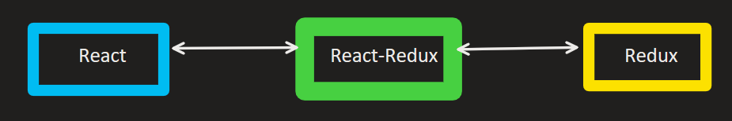
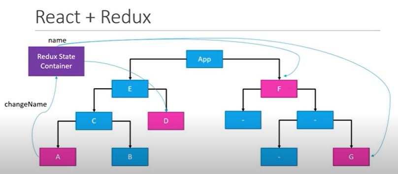
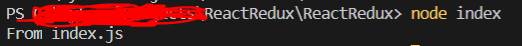

#  `React-Redux`

    -   React-Redux is the offical Redux UI libray for React




### `Perrequisites`

*   Fundamentals of React.
*   React Repository path for beginners on my Git  [Click hear](https://github.com/PrasanthReddy-Chittapu6683/ReactJs-V16.13.1/tree/master/reactjs-my-learnings) -> Goto reactJs.txt material file to better understanding from scratch. 


## `What is Redux`

*   __`Reduc is a predictable state container for JavaScript apps`__
*   Redux is for Javascript application.
    *   Redux can be used for React, Angular, Vue and even with Vanilla JavaScript.
    *   Redux is a library for JavaScript applications.    
*   Redux is a state container
    *   Redux sotres the state of your application.
    *   `state of an application` means state represented by all individual components of that application.
        *    Ex: 
            LoginFormComponent:
            ``` json
                state = {
                    userName: '',
                    password: '',
                    submitting:false
                }
            ```
            UserListComponent:
            ``` json
                state = {
                    users : []
                }
            ```
*   Redux is predictable
    *   Redux is a state container, In any Java script application state can change.
        Ex:  In todo list application - item status:(pending) -> item status:(completed)
    *   In Redux, all state transitions are explicit and it is possible to keep track of them 
    *   The changes in your application's state become predictable.
    *   Redux wil store and manage the application state.
*   To manage the state of your application in a predicable way, redux can help.

## `Why Redux in React?`

*   Already we have components in React having their own state. Question is why we need another tool to manage the state?
*   Consider an application with several components and nested componentes. 
    *   Suppose if we need textbox that use can enter `user name` in Component A .
    *   Now, Sibling Component B needs to use `user name`. In react will do this by lifting the Component state to Component C.
    *   Now data can be managed in the Parent Component C then provide the data, methods and varibale as `props`  to Component A and B.
    *   What if we need to display in other Child Component of the other Parent Component and so on.. we just need to lifting the state to higher Components.
    *   This is not that easy to make changes eveytime.
    *   In React apppliction, if we have large no of components and want to share the state or data to other components, state management could become trouble. This where __`REDUX`__ helps out.
    *   Using Redux, your state is contains outside the Components. If Component A want to update the update the state, it communicates with Redux state container.
    *   Using this seperate Redux State container only the respective components get data from Redux State.
        


### `Setup the project`

*   Go to project folder path in Terminal, enter the commmand
    *   __`npm init --yes`__ This will create a `package.json` file with settings
        ```json
            {
                "name": "ReactRedux",
                "version": "1.0.0",
                "description": "",
                "main": "index.js",
                "scripts": {
                    "test": "echo \"Error: no test specified\" && exit 1"
                },
                "repository": {
                    "type": "git",
                    "url": "git+https://github.com/PrasanthReddy-Chittapu6683/ReactRedux.git"
                },
                "keywords": [],
                "author": "",
                "license": "ISC",
                "bugs": {
                    "url": "https://github.com/PrasanthReddy-Chittapu6683/ReactRedux/issues"
                },
                "homepage": "https://github.com/PrasanthReddy-Chittapu6683/ReactRedux#readme"
            }
        ``` 
*   Now add  `Redux` as a dependency for our project. Run the command in terminal
    *   __`npm install redux`__  once it is completed we can see the dependency added to packag.json
        ```json
            "dependencies": {
                "redux": "^4.0.5"
            }
        ```
*   Lets create javscript file to write our code. __`index.js`__
    *   Just print `console.log("From index.js")` and run command __`node index`__ . This will print the log statement in terminal.
        

